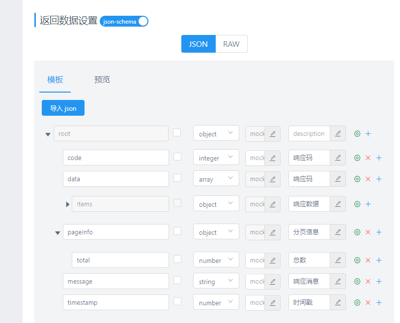

# YApi 文档生成工具 
`v1.0.0` `2020.09.29` `lhw`

该工具主要为了根据项目中的DTO/VO，直接生成相应的YApi文档需要的json数据。该工具主要依赖于实体中的注释和属性，进行YApi文档的生成。
使用该工具需要在构建DTO和VO时进行详细的字段注释。

>一般项目中都会直接根据数据库表，直接生成项目中的实体及其它基础代码。
为了规范开发需要在表设计中将每个字段进行详细的注释，在代码生成工具生成的代码中一般都会将相应的注释生成在实体中。
在开发接口的时候，可以根据接口创建相应的DTO和VO,在创建DTO和VO时，可以直接复制PO对象中的属性。
这样只要在数据库中将注释补全，在后面的流程中只需要进行复制就可以，在每个实体中都会有相应的的注释。  

## 使用流程
1）.根据接口生成需要的DTO/VO对象（需要进行属性注释）；  
2）.项目中引入工具的依赖；  
```
<dependency>
    <groupId>org.starr.util</groupId>
    <artifactId>Yapi-generator</artifactId>
    <version>1.0.0</version>
</dependency>
```
3）.编写具体的调用类；  
```
        //TODO 1.设置项目的基本路径
        GeneratorApi.basePath = "D:\\work_space\\idea_ws\\youdi2\\business-order-disassemble\\src\\main\\java\\";
        //2.设置需要排除的属性
//        GeneratorApi.excludeFields.add("");
        //3.设置java基础类型和YApi类型的转换map    key：java类的全类名  value: YApi中类型的名称
//        GeneratorApi.typeMap.put("","");
        //4.设置 对象包装  key:DocDataType  value:外层包装模板（%s会注入对象）
//        GeneratorApi.typePackageMap.put("","");
        //TODO 5.设置项目的基础包，用来区分 类是项目里的自定义类还是基础类型  （自定义类型）
        GeneratorApi.basePackage = "net.youdi.y.api";

        //TODO 需要转换的类信息
        Class<?> clz = PurchaseInfoVO.class;
        //TODO 需要设置数据类型  DocDataType
        String objStr = GeneratorApi.convertToYApiJson(clz, DocDataType.RETURN_OBJECT);
        System.out.println("-------------------------YApi------------------------------");
        System.out.println(objStr);
        System.out.println("-------------------------YApi------------------------------");
```
4）.使用<3>中代码生成YApi文档中需要的JSON数据；  
5）.打开YApi，新建具体的接口，  编辑 -> 参数设置 -> json -> JSON-SCHEMA: (选择开) -> 高级设置 -> （粘贴<4>中生成的JSON） -> (确认) 。  


## 工具限制
1).当前项目中暂不支持使用内部类；  
2).项目中的如果使用lombok生成get/set会报错，但是不影响具体的文档的生成，可以直接忽略；

## 项目API
1).GeneratorApi.basePath 项的基础路径，用于文档解析；  
2).GeneratorApi.basePackage 项目的基础包结构，用户项目内自定义类的判断，进行自定义类解析；  
3).GeneratorApi.excludeFields 排除的属性设置，用于排除类中不进行生成的文档的属性；  
如下为已配置：
```
 excludeFields.add("serialVersionUID");
```
4).GeneratorApi.typeMap 设置java类和 YApi类型的映射   key：java类的全类名  value: YApi中类型的名称；  
如下为已配置：
```
typeMap.put(List.class.getName(), "array");
typeMap.put(String.class.getName(), "string");
typeMap.put(Integer.class.getName(), "integer");
typeMap.put(Double.class.getName(), "number");
typeMap.put(BigDecimal.class.getName(), "number");
typeMap.put(LocalDateTime.class.getName(), "string");
typeMap.put(Long.class.getName(), "number");
```
5).GeneratorApi.typePackageMap 设置生成文档的外部包装的模板   key:DocDataType  value:外层包装模板（%s会注入对象的文档）  
项目中已经集成的模板：  
DocDataType.OBJECT 基础对象  
DocDataType.ARRAY 数组对象  

DocDataType.RETURN_OBJECT 统一返回包装对象  

DocDataType.RETURN_ARRAY 统一返回包装数组  
  
DocDataType.RETURN_PAGE  统一返回包装分页  


## 项目打包
项目中引用了JDK中的javadoc的工具类，需要引入JDK中的tools.jar。根据使用需求需要不同的导入方式，在注入私服时需要注入Yapi-generator-dependencies.jar  
1.个人使用，可以直接使用如下方式导入项目中lib目录下的tools.jar。该方式在打包时不会将tools.jar打到jar中，如果以jar的形式形式使用会报错。
```
<dependency>
    <groupId>com.sun</groupId>
    <artifactId>tools</artifactId>
    <version>1.8.jdk</version>
    <scope>system</scope>
    <systemPath>${project.basedir}/lib/tools.jar</systemPath>
</dependency>
```
 2.项目组使用，需要先执行lib目录下的install-tools.bat文件，将tools.jar打到本地maven库中。然后以如下方式导入
```
<dependency>
    <groupId>com.sun</groupId>
    <artifactId>tools</artifactId>
    <version>1.8.jdk</version>
</dependency>
```
